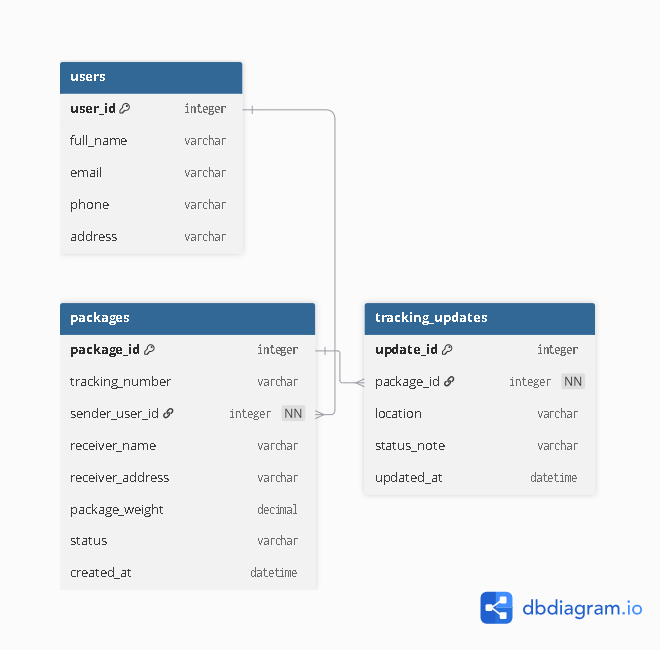

## Database Design Report

## Selected Database

Our team selected MySQL as the database for the Delivery Package Tracker project.

## Database Justification

MySQL is a good choice for this project because the system contains structured data with clear relationships between users, packages, and tracking updates. It is suitable for CRUD operations and helps us create a clear and easy-to-understand ERD.

## List of Tables

The system contains three main tables:

1. users
2. packages
3. tracking_updates

## Table 1: users

Purpose
This table stores customer or user information.
Fields
• user_id - Integer - unique ID for each user
• full_name - Text - stores the full name of the user
• email - Text - stores the email address
• phone - Text - stores the phone number
• address - Text - stores the address
Primary Key
• user_id
Foreign Key
• None
Relationship
• One user can have many packages.

## Table 2: packages

Purpose
This table stores package delivery details.
Fields
• package_id - Integer - unique ID for each package
• tracking_number - Text - unique tracking number
• sender_user_id - Integer - links the package to the user
• receiver_name - Text - stores receiver name
• receiver_address - Text - stores receiver address
• package_weight - Decimal - stores package weight
• status - Text - stores current package status
• created_at - Date and Time - stores when the package was created
Primary Key
• package_id
Foreign Key
• sender_user_id references users(user_id)

Relationship
• Many packages can belong to one user.
• One package can have many tracking updates.

## Table 3: tracking_updates

Purpose
This table stores the tracking history of each package.
Fields
• update_id - Integer - unique ID for each tracking update
• package_id - Integer - links the update to a package
• location - Text - stores current package location
• status_note - Text - stores tracking message or update note
• updated_at - Date and Time - stores when the update happened
Primary Key
• update_id
Foreign Key
• package_id references packages(package_id)
Relationship
• Many tracking updates can belong to one package.
Relationships Between Tables
• One user can create many packages.
• One package can have many tracking updates.

## ERD / Database Diagram

The ERD shows the relationship between the three main tables in the Delivery Package Tracker: users, packages, and tracking_updates. The users table stores customer information, the packages table stores delivery details, and the tracking_updates table stores tracking history for each package. One user can have many packages, and one package can have many tracking updates. This design helps organize package records and delivery progress clearly and efficiently.

